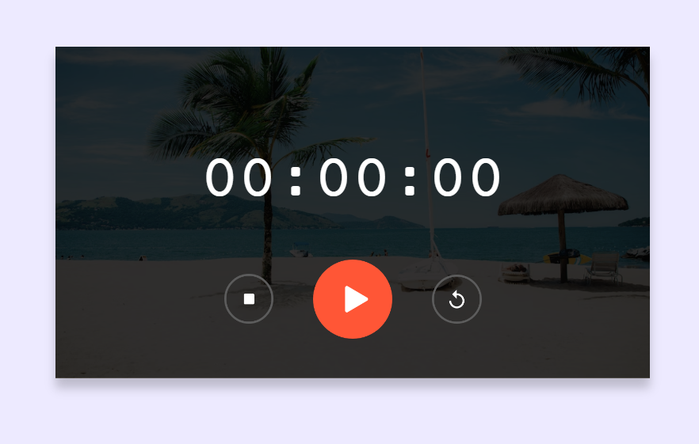

# Stopwatch ⏱️

## Overview
This project features a simple stopwatch with start, stop, and reset functionality. Users can start the stopwatch, stop it at any time, and reset it back to 00:00:00.

## Technologies Used 🚀
- **HTML**
- **CSS**
- **JavaScript**

## Usage 💻
1. Click the "Start" button to begin the stopwatch.
2. Click the "Stop" button to pause the stopwatch.
3. Click the "Reset" button to reset the stopwatch to 00:00:00.

## Live Demo 🌐
Live Demo: [Stopwatch Demo]()

## Installation
No special installation is required for this project. Simply download the project files and open the `index.html` file in a web browser.

## Stopwatch Logic
- The stopwatch increments every second.
- The display updates to show the elapsed time in HH:MM:SS format.
- Users can start, stop, and reset the stopwatch.

## Contributing 🤝
Feel free to use, modify, and contribute to the project! If you have any questions or feedback, you can reach me at nisagokdemir@gmail.com

## License
This project is licensed under the **MIT License**.

